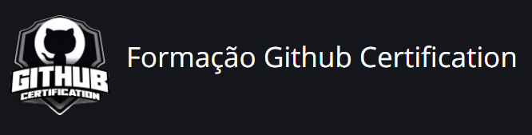

# Desafio Github Markdown

Desafio Github: "Explorando Colaboração e Markdown".

---

 😎 - Olá, Me chamo Ismael e sou desenvolvedor web. E este é um projeto para o curso de **Formação Github Certification** da DIO.

## Desafios do curso

| Etapas | Objetivos |
| :---: | :---: |
| 1ª | Criar conta no Github |
| 2ª | Criar um repositório |
| 3ª | Adicionar um README.md |
| 4ª | Colaboração no projeto |
| 5ª | Formate com Markdown |
| 6ª | Enviar projeto para a DIO |

## Descrição do Projeto

 😁 - Para a elaboração deste Projeto, cemecei já na criação de um repositório, pois já tinha a conta no Github, e junto com o repositório, já adicionei o meu README. 
  

 😭 - Até o momento, não conseguir achar alguém para colcaborar no meu projeto.
 >Porém, Colaborei no Projeto da @BabiDoo, com o seu projeto: "Guestbook" que também é aluna da DIO.
 

 😉 - Depois Atualizei o meu README com o Markdown, adicionando as informações necessárias.
 

 😃 - E para finalizar, enviei o projeto para a DIO!

